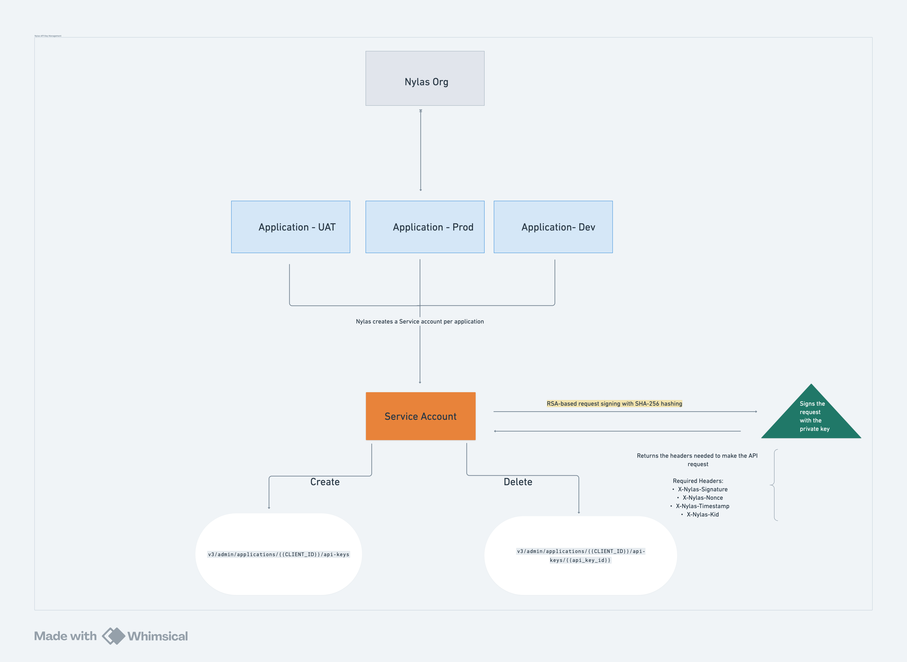

# Nylas API Key Generator

A command-line utility for generating authenticated requests to the Nylas Admin API for API key management.

## Overview

This script provides a secure way to interact with the Nylas Admin API for creating and deleting API keys. It handles all the necessary authentication steps including:

- Generating secure nonces
- Creating canonical JSON representations
- Signing requests with RSA private keys
- Formatting proper authentication headers
- Making HTTP requests directly to the Nylas API

## Flow Diagram

This diagram illustrates how API keys are created and managed through service accounts tied to Nylas applications.



## Authentication Flow

1. **Service Account Provisioning**: 
   - Nylas will generate an organization-level or application-level service account for your organization
   - This service account includes a private key (base64 encoded) and a private key ID
   - These credentials will be shared securely with your DevOps team

2. **Credential Storage**:
   - Your team must securely store the private key and private key ID
   - These credentials should be treated with the same security as passwords or API keys
   - Never commit these credentials to source control

3. **API Key Generation**:
   - This utility uses the service account credentials to authenticate with Nylas Admin API
   - It creates cryptographically signed requests that verify your identity
   - Upon successful authentication, you can generate application-specific API keys

## Authentication Technical Details

The authentication uses RSA-based request signing:

1. A canonical representation of the request is created (including path, method, timestamp, and nonce)
2. This representation is hashed using SHA-256
3. The hash is signed using the private key with PKCS1v15 padding
4. The signature is included in the request headers along with:
   - X-Nylas-Signature: The base64-encoded signature
   - X-Nylas-Nonce: A random string used once to prevent replay attacks
   - X-Nylas-Timestamp: Current timestamp to ensure request freshness
   - X-Nylas-Kid: The private key ID to identify which key was used for signing


## Endpoints

### 1. Create an API Key

```bash
curl --location 'https://api.us.nylas.com/v3/admin/applications/{NYLAS_CLIENT_ID}/api-keys' \
--header 'X-Nylas-Kid: {PRIVATE_KEY_ID}' \
--header 'X-Nylas-Nonce: {NONCE}' \
--header 'X-Nylas-Timestamp: {TIMESTAMP}' \
--header 'X-Nylas-Signature: {BASE64_SIGNATURE}' \
--header 'Content-Type: application/json' \
--data '{
    "expires_in": 120,
    "name": "my-api-key"
}'
```

**Sample Response**
```json
{
  "id": "{{API_KEY_ID}}",
  "name": "{{API_KEY_NAME}}",
  "application_id": "{{NYLAS_CLIENT_ID}}",
  "permissions": [
    "all"
  ],
  "status": "active",
  "expires_at": 1753300766,
  "created_at": 1742932766,
  "updated_at": 1742932766,
  "api_key": "{{API_KEY_VALUE}}"
}
```

---

### 2. Delete an API Key

```bash
curl --location --globoff --request DELETE 'https://api.us.nylas.com/v3/admin/applications/{NYLAS_CLIENT_ID}/api-keys/{API_KEY_ID}' \
--header 'X-Nylas-Kid: {PRIVATE_KEY_ID}' \
--header 'X-Nylas-Nonce: {NONCE}' \
--header 'X-Nylas-Timestamp: {TIMESTAMP}' \
--header 'X-Nylas-Signature: {BASE64_SIGNATURE}'
```

## Prerequisites

- Python 3.6+
- Required Python packages:
  - cryptography
  - python-dotenv
  - requests

## Installation

1. Clone this repository or download the script
2. Install required dependencies: 
   ```
   pip install -r requirements.txt
   ```
3. Create a `.env` file based on the provided `.env.example`:
   ```
   cp .env.example .env
   ```
4. Edit the `.env` file and add your Nylas credentials:
   - `NYLAS_PRIVATE_KEY_BASE64`: Your Base64-encoded private key
   - `NYLAS_PRIVATE_KEY_ID`: Your private key ID
   - `NYLAS_APP_ID`: Your application ID
   - `NYLAS_API_URL`: The Nylas API URL (e.g., https://api.us.nylas.com)

## Usage

The script can be used to create or delete API keys:

### Create a new API key

```bash
python nylas_api_key_generator.py create --name "my-api-key" --expires 3600
```

**Important Parameters:**
- `--name`: Must be a unique name for the API key
- `--expires`: Number of days until the key expires

This will:
- Generate the necessary authentication headers
- Make an HTTP request to the Nylas API
- Return the API key details including the key ID and secret

### Retrieve an existing API key

```bash
python nylas_api_key_generator.py get <api_key_id>
```

This will:
- Generate the necessary authentication headers
- Make an HTTP request to retrieve the specified API key
- Return the response from the Nylas API Key response without the API secret

### Delete an existing API key

```bash
python nylas_api_key_generator.py delete <api_key_id>
```

This will:
- Generate the necessary authentication headers
- Make an HTTP request to delete the specified API key
- Return the response from the Nylas API

### Rotate an API key

```bash
python nylas_api_key_generator.py rotate <old_key_id> --name "new-key-name" --expires 7776000
```

**Important Parameters:**
- `--name`: Must be a unique name for the new API key
- `--expires`: Number of days until the new key expires (default: 90 days)

This will:
- Create a new API key with the specified name and expiration
- Return both the old key ID and the new key details
- The old key remains active until you complete the rotation

### Complete an API key rotation

```bash
python nylas_api_key_generator.py complete-rotation <old_key_id>
```

This will:
- Delete the old API key after you've updated your applications to use the new key
- Return a success message confirming the deletion

### Debug mode

Add the `--debug` flag to any command to see detailed information about the signing process:

```bash
python nylas_api_key_generator.py create --debug
```

This will show:
- The canonical JSON representation before signing
- The hash being signed
- Other debugging information

## Response Format

When successful, the API will return a JSON response with details about the created or deleted API key.

### Create API Key Response Example

```json
{
   "id": "{{API_KEY_ID}}",
   "name": "{{API_KEY_NAME}},",
   "application_id": "{{NYLAS_CLIENT_ID}}",
   "permissions": [
      "all"
   ],
   "status": "active",
   "expires_at": 1753300766,
   "created_at": 1742932766,
   "updated_at": 1742932766,
   "api_key": "{{API_KEY_VALUE}}"
}
```

## Error Handling

The script will check for required environment variables and display appropriate error messages if they are missing.

## API Key Rotation

For best practices on securely rotating your API keys without service disruption, see our [API Key Rotation Strategy](./Rotation_Strategy.md).
